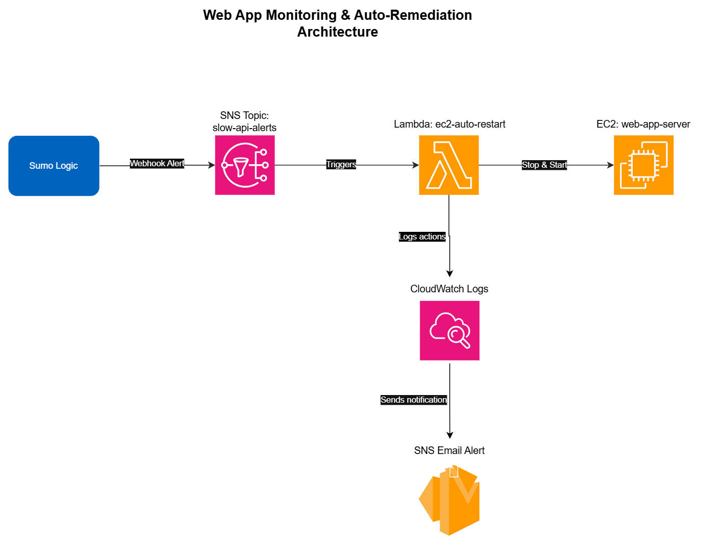

# Web App Monitoring & Remediation Solution

## Overview

A monitoring and auto-remediation solution for a web application experiencing
intermittent performance issues. The system detects slow API responses,
automatically restarts the affected server, and notifies the team — all without
manual intervention.

## Architecture



---

## Repository Structure

```
web-app-monitoring-remediation/
├── sumo_logic_query.txt        # Part 1 — Sumo Logic detection query + alert setup notes
├── lambda_function/
│   └── lambda_function.py      # Part 2 — Python Lambda auto-restart handler
├── terraform/
│   └── main.tf                 # Part 3 — Full infrastructure as code (EC2, Lambda, SNS, IAM)
└── README.md
```

> **Important:** The `terraform/` and `lambda_function/` folders must stay at the
> same level (both inside the same parent folder). Terraform's `main.tf` uses the
> relative path `../lambda_function` to zip the Python code automatically at plan time.

---

## Part 1 — Sumo Logic Query & Alert

**File:** `sumo_logic_query.txt`

The query identifies log entries where the `/api/data` endpoint exceeded 3 seconds,
groups them into 10-minute windows, and only surfaces windows with more than 5 occurrences.

**Alert configuration (done in the Sumo Logic UI):**

| Setting | Value |
|---|---|
| Alert name | Slow /api/data Responses |
| Time range | Last 10 minutes |
| Run frequency | Every 10 minutes |
| Trigger condition | Greater than 0 results |
| Notification | Webhook → Lambda URL |

The trigger condition is set to `> 0` because the query itself already enforces
the `> 5` threshold — any result means the breach already happened.

---

## Part 2 — AWS Lambda Function

**File:** `lambda_function/lambda_function.py`

### What it does
1. Reads `INSTANCE_ID` and `SNS_TOPIC_ARN` from environment variables.
2. Calls `ec2.stop_instances()` and waits (using a boto3 waiter) until fully stopped.
3. Calls `ec2.start_instances()` — this moves the instance to a new physical host.
4. Publishes a success/failure message to the SNS topic.
5. All actions log to CloudWatch Logs automatically via Python's `logging` module.

### Why stop + start instead of reboot
A reboot keeps the instance on the same host — faster, but won't fix hardware
degradation or host-level networking issues. Stop + start moves to a new host,
which is a more reliable remediation for persistent performance problems.

### Manual deployment steps (AWS Console)
```
1. AWS Console → SNS → Create topic → Standard → name: slow-api-alerts
   Copy the Topic ARN and save it.

2. AWS Console → EC2 → Launch instance
   Name: web-app-server | AMI: Amazon Linux 2023 | Type: t2.micro
   Copy the Instance ID once it shows "Running".

3. IAM → Roles → Create Role → AWS service → Lambda
   Add inline policy (see main.tf policy block for the JSON).
   Name the role: lambda-ec2-restart-role

4. Lambda → Create function → Author from scratch
   Name: ec2-auto-restart | Runtime: Python 3.12
   Permissions: use existing role → lambda-ec2-restart-role

5. Paste lambda_function.py into the code editor → Deploy

6. Configuration → Environment variables → Add:
     INSTANCE_ID   = i-xxxxxxxxxxxxxxxxx   (your EC2 instance ID)
     SNS_TOPIC_ARN = arn:aws:sns:...       (your SNS topic ARN)

7. Test with the sample event:
     {"source": "sumo_logic", "alert_name": "Slow /api/data Responses"}
```

---

## Part 3 — Terraform IaC

**File:** `terraform/main.tf`

### Resources created

| Resource | Purpose |
|---|---|
| `aws_instance.web_app` | The EC2 web-app server |
| `aws_sns_topic.alerts` | SNS notification topic |
| `aws_sns_topic_subscription.email` | Optional email subscription |
| `aws_iam_role.lambda_role` | Least-privilege IAM role for Lambda |
| `aws_iam_role_policy.lambda_policy` | Inline policy scoped to specific ARNs |
| `aws_lambda_function.ec2_restart` | The auto-restart function (auto-zipped) |
| `aws_lambda_permission.allow_sns` | Grants SNS permission to invoke Lambda |
| `aws_sns_topic_subscription.lambda_trigger` | Wires SNS → Lambda |

### Least privilege highlights
- EC2 permissions (`StopInstances`, `StartInstances`, `DescribeInstances`) are
  scoped to the **specific instance ARN**, not `*`.
- SNS `Publish` is scoped to the **specific topic ARN**, not all topics.
- CloudWatch Logs uses `*` only because log group names are assigned at runtime
  — this is standard Lambda practice.

### Deploy steps
```bash
# 1. Open a terminal inside the terraform/ folder
#    (VS Code: right-click terraform/ → Open in Integrated Terminal)

# 2. Download the AWS provider plugin (once per project)
terraform init

# 3. Preview — no changes made yet
terraform plan -var="notification_email=you@example.com"

# 4. Deploy — type 'yes' when prompted
terraform apply -var="notification_email=you@example.com"

# 5. Tear down when done
terraform destroy
```

After apply, Terraform prints three outputs: EC2 instance ID, Lambda function name,
and SNS topic ARN. Verify each resource exists in the AWS Console.

---

## Assumptions & Deviations

| Area | Assumption / Decision |
|---|---|
| Log format | Application logs are JSON with `endpoint` and `response_time_ms` (ms) fields |
| Response time unit | Stored in milliseconds; threshold is `> 3000`. If seconds, use `> 3` |
| Network | EC2 uses the default VPC for simplicity. Production would use a dedicated VPC with subnets and security groups |
| Remediation strategy | Stop + start (not reboot) to move instance to a new physical host |
| Sumo Logic integration | Webhook notification points to the Lambda via API Gateway or SNS. Sumo Logic Terraform provider not used — requires per-account API credentials |

---

## Screen Recordings

| Part | Recording Link |
|---|---|
| Part 1 — Sumo Logic Monitoring & Alert Setup | https://youtu.be/Fuaf4yLS40w |
| Part 2 — AWS Lambda Auto-Remediation | https://youtu.be/yrUSM9iWar0 |
| Part 3 — Terraform - IaC | https://youtu.be/vZUmnAz7DLs |

> Upload recordings to YouTube, Google Drive or Zoom and set sharing to
> "Anyone with the link". Test the links in a private/incognito browser tab
> before submitting.
